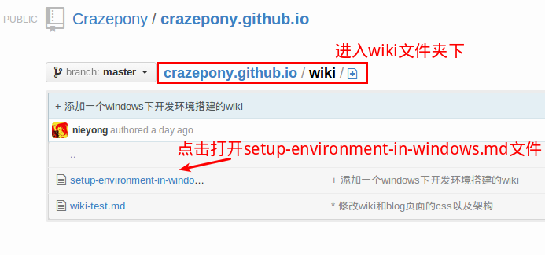
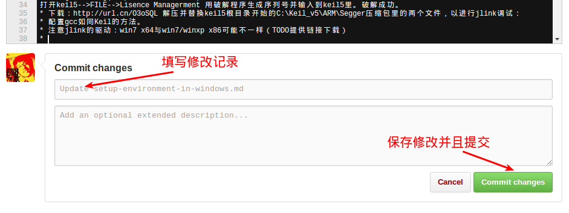

# {{ page.title }}

## Crazepony站点
Crazepony网站包括了[Crazepony主站](http://crazepony.github.io/index-cn.html)，[Crazepony Wiki](http://crazepony.github.io/wiki.html)百科站点，[Crazepony Blog](http://crazepony.github.io/blog.html)博客站点。

Crazepony网站建设和部署使用了多种开源的技术和平台。

* 站点部署在github上，使用了github page网站服务器功能，并且整个站点框架使用[jekyll](http://jekyllrb.com/)，这是github page支持的静态网站框架。
* 前端框架使用[bootstrap](https://github.com/twbs/bootstrap)开源项目
* 百科站点和博客站点内容全部使用markdown标志语言编辑

## Crazepony站点源码结构
Crazepony站点源代码托管在github上，点击[这里](https://github.com/Crazepony/crazepony.github.io)。由于本站点使用了jekyll框架，所以其结构基本上符合jekyll框架结构。

```
├── assets              |网页相关的资源文件夹，例如图片，定制css，javascript文件等
├── dist                | bootstrap相关文件，包括css，字体，javascript
├── _layouts            | 网页模板文件，用于定义网页的header，footer等
├── wiki                | 存放wiki源文件，markdown格式
├── _posts              | 存放博客源文件，markdown格式
├── blog.html           | 博客首页
├── _config.yml         | jekyll配置文件
├── index-cn.html       | 站点首页（中文）
├── index.html          | 站点首页（英文）
├── README.md           | 本文件
└── wiki.html           | wiki首页

```
修改最多的就是wiki目录和posts目录下的源文件，并且都为markdown格式。在文件最开始加入了一个特定格式的头，用于jekyll生成静态网页。

## 直接在网页上修改
参与网站wiki，blog等的建设其实很简单。对于不熟悉git/github，或者不能够本地修改的伙伴，你也可以直接到网页上进行修改。下面以修改wiki中的setup-environment-in-windows页面为例：

* 找到该网页对应的markdown文件，如上节中所属，wiki源文件都存放在wiki文件夹。

* 点击打开该文件，并且点击右侧的Edit按钮。这时候你可以编辑修改该文件，还可以点击Preview按钮预览修改效果。

* 修改结束之后，请务必协商修改的记录，然后点击Save按钮保存该文件。这个时候到网站上刷新该页面，则你的修改应该已经生效。


## clone到本地修改
你可以将该项目源代码clone到本地，进行修改调试，然后上传github，就能够在网站上看到你修改的内容。

```
$git clone git@github.com:Crazepony/crazepony.github.io.git

```

由于使用了jekyll框架，所以在本地调试时需要安装jekyll。对于ubuntu用户，命令如下：

```
//jekyll是用ruby写的，所以需要先安装ruby开发环境
$ sudo apt-get install ruby
$ sudo apt-get install ruby-dev
$ sudo gem install rdoc

//安装jekyll
$ gem install jekyll

//进入站点源码目录，并且开启jekyll服务
$ cd crazepony.github.io
$ jekyll serve

```

开启jekyll服务之后，在站点源代码下，会生成一个名为_site的目录，该目录下就为站点的html静态网页。在浏览器中输入http://localhost:4000/，就能够看到修改之后站点的效果。

## 其他
markdown语法说明：
* [快速入门](http://wowubuntu.com/markdown/basic.html)
* [Markdown Basics](https://help.github.com/articles/markdown-basics)
* [GitHub Flavored Markdown](https://help.github.com/articles/github-flavored-markdown)

git/github入门：
* [git使用简易指南](http://www.bootcss.com/p/git-guide/)
* [沉浸式学 Git](http://igit.linuxtoy.org/index.html)
